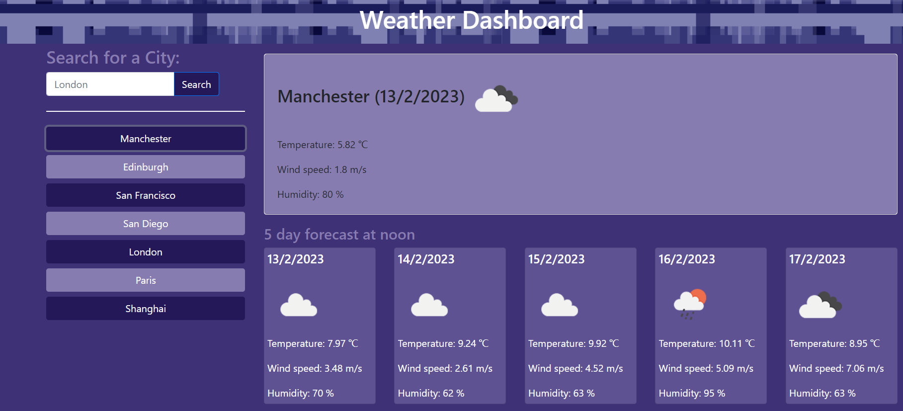

# weather-dashboard

OpenWeather API with web page dashboard.
This weather dashboard is different from [OpenWeather Dashboard](https://openweathermap.org/weather-dashboard).

## Usage

1. visit [deployment](https://v7lanw.github.io/weather-dashboard/)
2. Type a city (Manchester) and click "Search"
3. Get weather for today, and for future 5 days.

## Features

1. Responsive web design
2. Prepend search history
3. Night mode
4. Flat icons
5. OpenWeather API
   - Direct geocoding, [get coordinates by location name](https://openweathermap.org/api/geocoding-api#direct).
   - Call 5 day / 3 hour forecast data, here comes the [doc](https://openweathermap.org/forecast5#5days).
   - List of all API parameters with [units](https://openweathermap.org/weather-data), and then render correctly.
   - [Weather Icon](https://openweathermap.org/weather-conditions)
6. Different from OpenWeather Dashboard, which is featured as trigger. This app is only used for looking up weather forecasts in 5 days.

## Github Pages

<https://v7lanw.github.io/weather-dashboard/>
